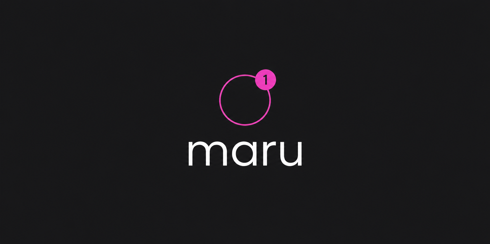
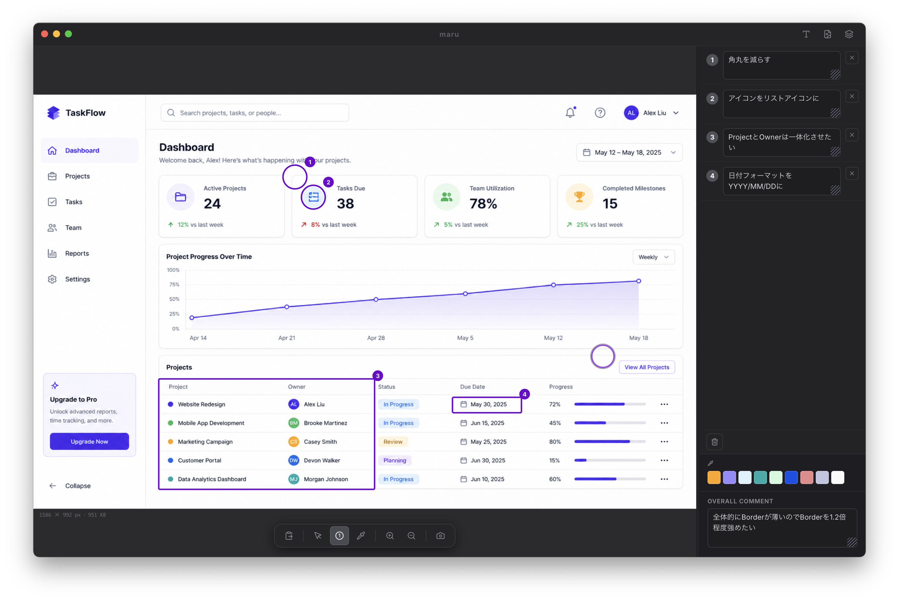

# maru

**Annotate screenshots, then hand them to your AI coding agent. One image, all context.**



---

## Why

General-purpose image editors and annotation tools are great for marking up screenshots — but they stop short of the last step: getting that annotated image (and the per-marker notes) into your AI agent's context in one shot.

maru is purpose-built for that handoff. Paste a screenshot, stamp numbered markers, write per-marker instructions in the inspector, then copy a single composite image — photo, circles/rectangles, and legend burned in — and paste it directly into Claude, ChatGPT, or any other AI coding tool.



---

## Features

- **Numbered markers** — circle (click) and rectangle (drag) with auto-numbered badges
- **Per-marker text** — inspector panel shows an input field for each marker; re-numbered automatically on delete
- **Composite image copy (⌘⇧C)** — annotated image + text legend burned into a single PNG, ready to paste into any AI tool
- **Text-only copy (⌘T)** — circled-number list ①②③… for pasting as plain text
- **Annotated image copy (⌘E)** — image + markers at current display scale, no legend
- **Adaptive contrast** — marker color switches between hot magenta and deep purple based on background luminance (WCAG-based)
- **Color palette & eyedropper** — extracts up to 16 representative colors from the pasted image; eyedropper lets you sample any pixel; click any swatch to copy its hex
- **Multiple windows** — ⌘N opens a new independent window
- **Screen capture** — press S to capture a region directly into a new window (wraps macOS `screencapture -i`)
- **Pan & zoom** — two-finger scroll to pan, pinch or ctrl+scroll to zoom, toolbar ± buttons

---

## Install

1. **Download the right build** from [Releases](../../releases):
   - **Apple Silicon** (M1–M4): `maru-*-arm64.dmg`
   - **Intel**: `maru-*.dmg`

   Not sure which Mac you have? Run `uname -m` in Terminal — `arm64` = Apple Silicon, `x86_64` = Intel.

2. **Open the dmg and drag maru into `/Applications`.**

3. **Clear the quarantine flag.** maru is ad-hoc signed but **not notarized by Apple**, so on first launch macOS quarantines it and shows *"Apple could not verify maru is free of malware."* Remove the flag once in Terminal:

   ```bash
   xattr -cr /Applications/maru.app
   ```

   GUI alternative: **System Settings → Privacy & Security**, scroll to the message about `maru.app`, click **Open Anyway**, then reopen maru and click **Open**.

4. **Open maru.** You only need to do steps 3–4 once.

> Why the extra step? Notarizing an app requires a paid Apple Developer account ($99/yr). maru is free and unfunded, so it ships ad-hoc signed instead — the `xattr` line above is the one-time cost of that.

---

## Usage

1. Paste a screenshot: press **⌘V**, or click the clipboard icon in the toolbar
2. Switch to Annotate mode: press **A** (or click the numbered-circle icon)
3. Click to stamp a numbered circle, or drag to draw a numbered rectangle
4. Type instructions for each marker in the right-hand inspector panel
5. (Optional) Add overall context in the **Overall comment** field
6. Press **⌘⇧C** to copy the composite image with legend burned in
7. Paste into Claude, ChatGPT, or any AI tool — everything is in one image

---

## Keyboard shortcuts

| Key | Action |
|-----|--------|
| ⌘V | Paste image from clipboard |
| ⌘N | New window |
| A | Annotate tool (click = circle, drag = rectangle, click existing = delete) |
| V | Select / Pan |
| I | Eyedropper (click to sample color) |
| Esc | Exit current tool |
| + / = | Zoom in |
| − | Zoom out |
| S | Capture screen region to new window |
| ⌘T | Copy text (numbered list) |
| ⌘E | Copy annotated image |
| ⌘⇧C | Copy composite image with legend |

---

## Build from source

```bash
git clone https://github.com/wemra3/maru.git
cd maru
npm install
npm run dev        # development (hot reload)
npm run build      # production build
npm run dist       # build + package as DMG (macOS)
```

Requirements: Node.js 20+, npm 10+.

The DMG is output to `release/`.

---

## Support

maru is free and open source. If it saves you time, you can support its development:

[](https://github.com/sponsors/wemra3)

No paywalls, no tracking — entirely local. ☕

---

## License

[MIT](LICENSE) © 2026 wemra
